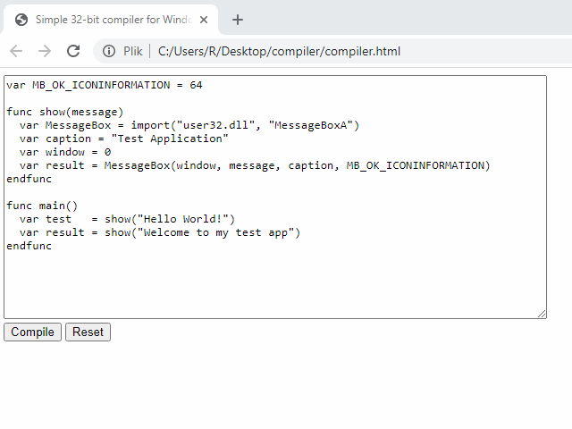

# CompilerJS
Compiler of my own very limited programming language, made in pure Javascript/HTML, works inside a web browser on a client side.
Produces 32-bit Windows application (.exe).
Code is converted straight into x86 assembly, there is no interpreter attached to the output .exe files.
*This project is discontinued.*

## Syntax
**var number = 1** - creates int variable
**var text = "test"** - creates string variable
**func name(arguments) / endfunc** - function statement
**import(library, procedureName)** - returns function handle found in .dll library